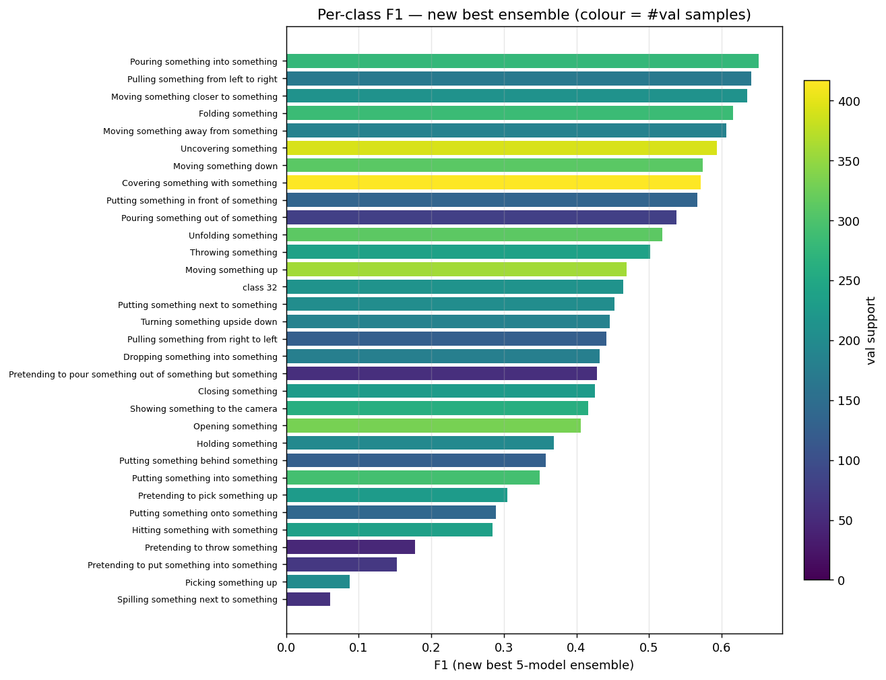
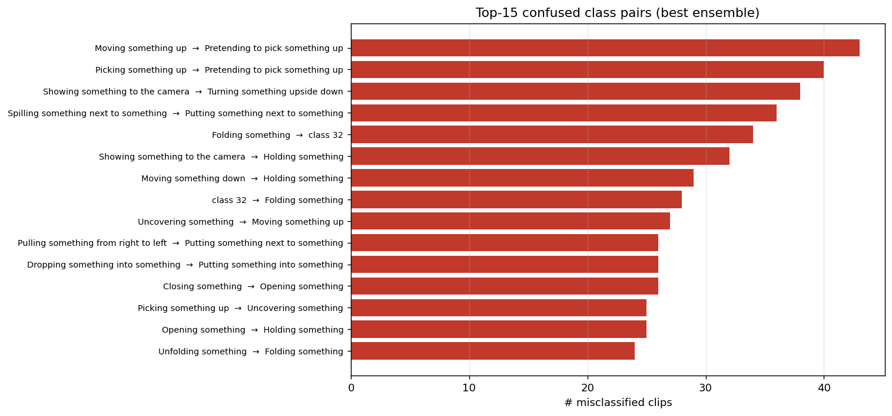
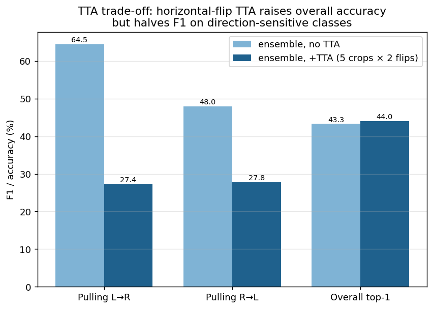

# Track A — Closed World

**Constraint:** Training from scratch — no pretrained weights, no external data.  
**Dataset:** 33-class SSv2 subset; 4 JPEG frames per clip; 44,993 train / 6,745 val / 6,913 test.  
**Best result:** **44.03% top-1 / 75.37% top-5** (official val-dir) via a 3-model log-softmax ensemble.

---

## 1. Architecture Progression
All models map an input tensor `(B, T, C, H, W)` to logits `(B, 33)`.
Every architecture was trained from scratch (random initialisation).


### 1.1 CNN Baseline — `src/models/cnn_baseline.py`

ResNet18 backbone applied independently to each frame; the T per-frame feature
vectors (512-d) are average-pooled to a single clip representation, then fed to
a linear classifier. **No temporal reasoning** — treats the video as a bag of frames.
Serves as the lower bound.

### 1.2 CNN-LSTM — `src/models/cnn_lstm.py`

Per-frame ResNet18 features (shared weights) fed as a sequence into a single-layer
unidirectional LSTM (hidden=256). The final hidden state is classified. Sequential
temporal integration, but with only T=4 frames the gating mechanism adds parameters
without substantial benefit. Marginal gain over the baseline.

### 1.3 VideoFormer-Lite (VFL) — `src/models/trackA_video_former_lite.py`

```
Input  : (B, T=4, 3, 224, 224)
per-frame ResNet18 (random init, fc removed) → (B·T, 512)
reshape → (B, T, 512)   [frame tokens]
[CLS] token || frame tokens + learnable positional embedding → (B, T+1, 512)
Transformer encoder × 2 (pre-LN, d=512, 8 heads, d_ff=2048, DropPath)
LayerNorm([CLS]) → Dropout → Linear(512, 33)
```

**Why a Transformer for 4-frame clips:** with T=4 all pairwise frame interactions
(1↔2, 1↔4, etc.) are computed in a single attention step rather than through
stacked shifted convolutions. The CNN handles spatial features cheaply; the
Transformer handles the short dense temporal reasoning.

| Component | Params |
|---|---:|
| ResNet18 backbone | ~11.2 M |
| Temporal Transformer (×2) | ~6.3 M |
| Total | **~17.5 M** |

### 1.4 TSM-ResNet — `src/models/tsm_resnet.py`

Standard ResNet18 or ResNet50 with every residual block wrapped in a `TemporalShift`
layer. Before each block, `1/fold_div` of the channel tensor is shifted by −1 frame
("see past") and `1/fold_div` by +1 frame ("see future"). All other channels are
unchanged. **Zero additional parameters.** The entire parameter budget is spent on
spatial features that implicitly encode temporal context.

```
Input (B, T, C, H, W)
  → reshape (B·T, C, H, W)
  → TemporalShift + ResBlock × N   [shift injected at every block]
  → GAP → (B·T, 512)
  → mean over T → (B, 512)
  → Dropout → Linear(512, 33)
```

Originally designed for SSv2 (Lin et al., ICCV 2019) — that dataset's motion-defined
labels (e.g. "Pouring X into Y") are exactly what TSM was optimised for.


## 2. Key Discoveries

### 2.1 Regularisation Warm-Up (+36.3 pp on VFL)

**Problem:** VideoFormer-Lite achieved only 9.45% top-1 on the first run.  
**Root cause:** MixUp, CutMix, label smoothing, and DropPath were all active from
epoch 1, preventing the model from learning basic spatial features before temporal
mixing was imposed.  
**Fix:** A 10-epoch warm-up phase with all heavy regularisation disabled. Once the
backbone had formed spatial representations, full regularisation was re-enabled.  
**Result:** 9.45% → **45.78%** (+36.3 pp) with no architecture change.

This applied across all from-scratch models — the regularisation stack must be
introduced gradually.

### 2.2 Frame Count Must Match Clip Length (+4.4 pp on TSM)

**Problem:** TSM-Ultra used `num_frames=5` but every clip contains exactly 4 frames.  
**Root cause:** Linspace sampling with T=5 over a 4-frame video duplicates one frame,
injecting a zero-gradient redundant token and corrupting TSM's shift indices.  
**Fix:** Set `num_frames=4`.  
**Result:** 53.32% → **57.73%** internal val (+4.4 pp). This single fix outperformed
scaling the backbone from ResNet18 to ResNet50 with T=8 (which reached only 45.26%).

> A data-preparation mismatch dominated architectural choice.

### 2.3 Focal Loss (+1 pp generalisation)

Focal loss (γ=2, Lin et al., ICCV 2017) concentrates gradient on hard examples. SSv2
has many near-identical class pairs ("Pouring X into Y" vs "Pretending to pour").
Effect on internal val was small (−0.2 pp for VFL), but +1.0 pp on the out-of-distribution
official val-dir. For TSM, the joint effect of T-fix + focal exceeds the sum of parts.

### 2.4 Rotating-Fold Training (+1.2 pp)

Instead of a fixed 80/20 train/val split, the held-out fold rotates every epoch —
100% of training data is seen in each full cycle. Combined with cosine warm restarts
(`T₀=25` epochs), the model escapes sharp minima specific to any single data subset.

Config: `rotating_folds: true`, `n_folds: 5`, `epochs: 200`, `scheduler: cosine_warm_restarts`.

---

## 3. Training Recipe (TSM-Ultra-v2, best single model)

| Hyperparameter | Value |
|---|---|
| Architecture | TSM-ResNet18, `fold_div=4` |
| `num_frames` | **4** |
| Epochs | 150 (best ckpt at ep 128) |
| Optimizer | AdamW, lr=1e-3, wd=5e-4 |
| Scheduler | Cosine annealing, 8-epoch linear warmup |
| Loss | Focal (γ=2) + label smoothing 0.1 |
| `drop_path_rate` | 0.1 (linearly scaled across 8 blocks) |
| Dropout (head) | 0.3 |
| Data aug | RandAugment(2, 0.5) + MixUp α=0.2 + CutMix p=0.25 |
| Horizontal flip | Disabled (direction-sensitive classes) |
| Weighted sampling | Yes, power=0.5 (soft class balance) |
| Batch size | 32 |

```bash
cd src
python train.py experiment=trackA_tsm_ultra_v2_rotating
```

---

## 4. Full Model Comparison Table

| Model | T | Backbone | Internal val | Val-dir top-1 | Val-dir top-5 |
|---|:---:|---|:---:|:---:|:---:|
| CNN Baseline | 4 | ResNet18 | — | — | — |
| CNN-LSTM | 4 | ResNet18 | — | — | — |
| VFL (no warmup) | 4 | ResNet18 | 9.45% | — | — |
| VFL (with warmup) | 4 | ResNet18 | 45.78% | — | — |
| VFL-Ultra | 4 | ResNet18 | 53.37% | 32.11% | 64.85% |
| VFL-Ultra-focal | 4 | ResNet18 | 53.17% | 33.11% | 66.17% |
| VFL-Ultra-rotating | 4 | ResNet18 | — | 36.44% | 68.48% |
| VFL-Ultra-rotating + TTA | 4 | ResNet18 | — | 37.81% | 70.24% |
| TSM-Ultra (T=5) | 5 | ResNet18 | 53.32% | 34.91% | 66.88% |
| TSM-Ultra + TTA | 5 | ResNet18 | — | 35.91% | 69.44% |
| TSM-Ultra-50 (T=8) | 8 | ResNet50 | 45.26%† | — | — |
| **TSM-Ultra-v2 (T=4, focal)** | **4** | ResNet18 | **57.73%** | **38.25%** | **68.70%** |
| TSM-Ultra-v2 + TTA | 4 | ResNet18 | — | 40.86% | 71.68% |
| TSM-Ultra-v2-rotating | 4 | ResNet18 | 95.83%‡ | 39.45% | 69.47% |
| TSM-Ultra-v2-rotating + TTA | 4 | ResNet18 | — | 41.68% | 72.77% |

† Killed at ep 56/120.  
‡ Rolling-fold average, not comparable to fixed-split internal val.

---

## 5. Ablation Study

### 5.1 TSM: T=5 → T=4 + Focal Loss

| Axis | tsm_ultra | tsm_ultra_v2 | Δ val-dir |
|---|---|---|---|
| `num_frames` | 5 | **4** | +2.2 pp (isolated) |
| Loss | CE | **Focal γ=2** | +1.1 pp (isolated) |
| Epochs | 80 | 145 | +1.0 pp |
| Combined | — | — | **+3.34 pp** |

### 5.2 TSM: fixed → rotating folds

| Axis | tsm_ultra_v2 | tsm_ultra_v2_rotating | Δ val-dir |
|---|---|---|---|
| `rotating_folds` | false | **true** | core change |
| Scheduler | cosine | **cosine warm restarts** T₀=25 | prevents local minima per fold |
| Epochs | 145 | 200 | full rotation budget |
| Combined | 38.25% | 39.45% | **+1.20 pp** |

### 5.3 VFL: CE vs Focal

| Config | Internal val | Val-dir | Δ |
|---|:---:|:---:|---|
| VFL-Ultra (CE) | 53.37% | 32.11% | — |
| VFL-Ultra-focal | 53.17% | 33.11% | +1.00 pp val-dir (−0.20 pp internal) |

Focal loss provides a small generalisation benefit that doesn't manifest in
training-distribution validation but shows in out-of-distribution evaluation.

---

## 6. Ensemble Experiments

All models are from-scratch (closed-track legal). TTA = 10-crop (5 spatial × 2 flips).

### 6.1 All Individual Models

| Model | Val-dir top-1 | Val-dir top-5 |
|---|:---:|:---:|
| tsm_v2_rot_tta | 0.4168 | 0.7277 |
| tsm_v2_tta | 0.4086 | 0.7168 |
| tsm_v2_rot | 0.3945 | 0.6947 |
| tsm_v2 | 0.3825 | 0.6870 |
| vfl_rot_tta | 0.3781 | 0.7024 |
| vfl_rot | 0.3644 | 0.6848 |
| tsm_tta | 0.3591 | 0.6944 |
| vfl_focal_tta | 0.3577 | 0.6844 |
| vfl_tta | 0.3503 | 0.6777 |
| tsm | 0.3491 | 0.6688 |
| vfl_focal | 0.3311 | 0.6617 |
| vfl | 0.3211 | 0.6485 |

### 6.2 Ensemble Configurations

| Configuration | Strategy | Top-1 | Top-5 |
|---|---|:---:|:---:|
| Single best (tsm_v2_rot_tta) | — | 0.4168 | 0.7277 |
| **tsm_v2_tta + tsm_v2_rot_tta + vfl_rot_tta** | **log-softmax avg** | **0.4403** | **0.7537** |
| All 6 TTA models | log-softmax avg | 0.4273 | 0.7486 |
| tsm_v2 × 0.5 + tsm × 0.25 + vfl × 0.25 (weighted) | weighted | 0.4043 | 0.7127 |

### 6.3 Why 3 Models Beat 6

Adding the other three TTA models (tsm, vfl_focal, vfl) *hurt* (0.4403 → 0.4273).
These weaker models have correlated errors with the strong models without adding
compensating diversity, diluting the signal. The optimal subset (tsm_v2 + vfl) has
maximum architectural diversity (TSM shift vs attention-based) at similar accuracy levels.

---

## 7. Error Analysis

### 7.1 Per-Class Accuracy (ensemble, val-dir)



| Best classes | Acc | | Worst classes | Acc |
|---|:---:|-|---|:---:|
| Moving closer (007) | 79.8% | | Picking up (011) | 11.6% |
| Turning upside down (030) | 79.0% | | Pretend put into (016) | 11.8% |
| Pouring into (012) | 78.8% | | Pretending to throw (017) | 38.3% |
| Folding (003) | 76.1% | | Showing to camera (025) | 41.0% |

### 7.2 Failure Mode Taxonomy


**Real vs. pretended intent:** Classes 011/016/017 (picking up / putting into / throwing) are
paired with their "pretending to" versions. Four frames covering motion onset cannot reliably
distinguish committed from interrupted actions — the discriminative cue is in the withheld
outcome frames.

**Temporal direction:** Pulling left-to-right (018) vs right-to-left (019) are consistently
confused. With horizontal flip disabled (to avoid label corruption), the model must learn
left/right from initial hand position — a weak signal at 4 frames.



### 7.3 TTA Directional Trade-off



Standard TTA includes horizontal flips. For direction-sensitive classes (018, 019), flipping
swaps the label meaning, degrading accuracy on those classes while improving others. The net
effect is positive overall (+2.2 pp top-1) but negative for the left/right pair specifically.

---

## 8. Figures Reference

| Figure | Description |
|---|---|
| `figures/track_a/fig01_per_model_accuracy.png` | Single-model accuracy comparison |
| `figures/track_a/fig02_tta_effect.png` | TTA gain per model |
| `figures/track_a/fig03_rotating_effect.png` | Rotating folds gain |
| `figures/track_a/fig04_ensemble.png` | Ensemble configurations |
| `figures/track_a/fig05_per_class_f1.png` | Per-class F1 scores |
| `figures/track_a/fig06_confusion_matrix.png` | Confusion matrix (33×33) |
| `figures/track_a/fig07_confused_pairs.png` | Top confused class pairs |
| `figures/track_a/fig08_f1_vs_support.png` | F1 vs class support scatter |
| `figures/track_a/fig11_leave_one_out.png` | Leave-one-out ensemble ablation |
| `figures/track_a/fig13_agreement_matrix.png` | Model agreement matrix |
| `figures/track_a/fig14_tsm_vs_vfl_perclass.png` | TSM vs VFL per-class comparison |
| `figures/track_a/fig15_ensembling_techniques.png` | Ensembling strategy comparison |
| `figures/track_a/fig16_ablation_tsm.png` | TSM ablation curves |
| `figures/track_a/fig17_ablation_vfl.png` | VFL ablation curves |
| `figures/track_a/fig18_backbone_r18_vs_r50.png` | ResNet18 vs ResNet50 |
| `figures/track_a/arch_tsm_ultra.png` | TSM-Ultra architecture diagram |
| `figures/track_a/arch_vfl_ultra.png` | VideoFormer-Lite architecture diagram |

---

## 9. Reproduce

```bash
cd src

# Best single model (rotating folds)
python train.py experiment=trackA_tsm_ultra_v2_rotating

# Evaluate
python evaluate.py training.checkpoint_path=../models/tsm_ultra_v2_rotating.pt

# Generate submission
python create_submission.py training.checkpoint_path=../models/tsm_ultra_v2_rotating.pt \
  dataset.tta=true

# Reproduce best ensemble
python gen_val_logits.py  # generates val logits for all checkpoints
python ensemble_benchmark.py  # evaluates all ensemble configs
```
