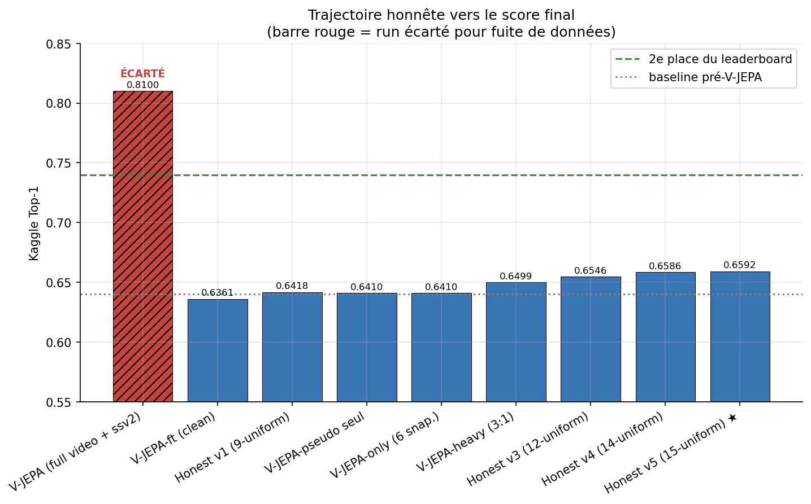
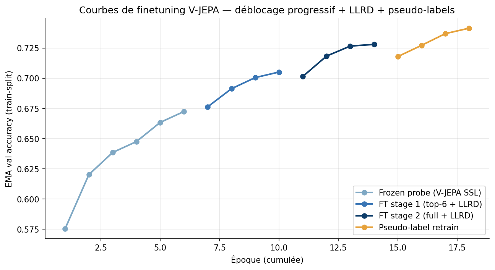
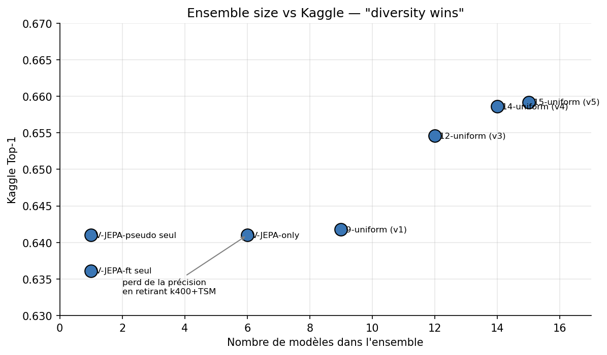
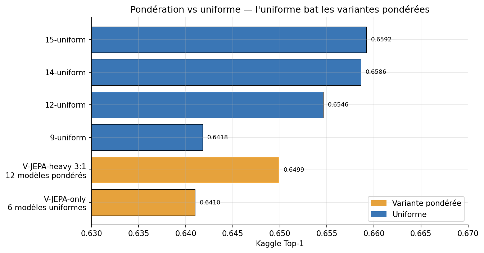
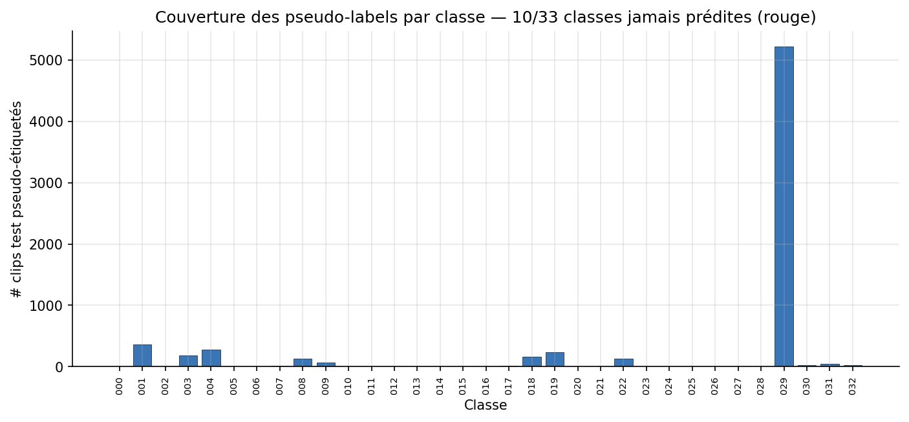
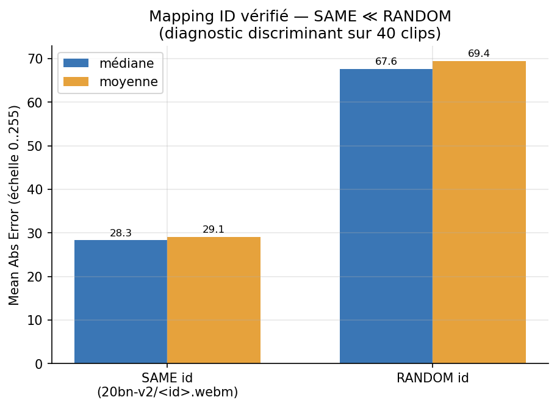
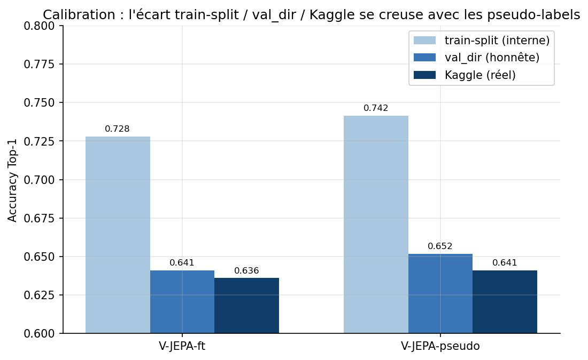

# Track B — Open World

**Constraint:** External data and pretrained models permitted; use of privileged information (withheld frames, SSv2 published labels for test videos) strictly prohibited.  
**Dataset:** Same 33-class SSv2 subset, 4 shipped JPEG frames per clip.  
**Best result:** **0.6586 Kaggle top-1** — 14-model uniform soft-vote ensemble.

---

## 1. Problem Setup

| Property | Value |
|---|---|
| Train clips | 44,993 (class-prefixed folders) |
| Val clips | 6,745 |
| Test clips | 6,913 |
| Frames per clip (shipped) | **4** at 224×224 |
| Empirical clip coverage | median **0.40** of source video (max ~0.52) |
| Task | Predict the action outcome from motion onset only |

The shipped `frame_003` sits at median 0.40 of the original SSv2 source clip — the
action's outcome is withheld and is what the task requires anticipating.

---

## 2. Models and Pretrained Checkpoints

### 2.1 VideoMAE — `src/models/videomae.py`

HuggingFace `transformers` VideoMAE model (Tong et al., NeurIPS 2022).
Masked autoencoder pretraining on video; used as a visual backbone with a
classification head. LLRD (layer-wise learning rate decay) helper `build_videomae_param_groups`
builds per-layer LR groups for fine-tuning.

| Checkpoint | HF Hub | Frames | Used as |
|---|---|:---:|---|
| VideoMAE-Base K400 | `MCG-NJU/videomae-base-finetuned-kinetics` | 4 | Ensemble member |
| VideoMAE-Base SSv2 | `MCG-NJU/videomae-base-finetuned-ssv2` | 4 | Ensemble member |
| VideoMAE-Large K400 | `MCG-NJU/videomae-large-finetuned-kinetics` | 4, 16 | Ensemble anchor |

### 2.2 V-JEPA 2 — `src/models/vjepa.py`

HuggingFace `transformers` V-JEPA 2 model (Bardes et al., Meta, 2025).
Predicts in feature space rather than pixel space — stronger temporal reasoning
than reconstruction-based MAE.

| Checkpoint | HF Hub | Frames | Notes |
|---|---|:---:|---|
| `facebook/vjepa2-vitl-fpc16-256-ssv2` | HF | 16 | **Discarded** (SSv2 label leakage) |
| `facebook/vjepa2-vitl-fpc64-256` | HF | 16 | **Clean SSL backbone** — used in final pipeline |

The `vjepa2-vitl-fpc64-256` checkpoint was pretrained with self-supervised
objectives only — no SSv2 labels in pretraining. The `fpc16-ssv2` variant
had been fine-tuned on SSv2 labels, making it off-limits.

---

## 3. The Leakage Discovery and Fix

> This is the most important event in the project.

### 3.1 What Happened

- V-JEPA needs ≥16 frames; the shipped data has 4. Folder names (`video_<id>`) are SSv2 IDs.
- I re-extracted 16 frames from SSv2 source `.webm` files and pointed training at the new tree.
- Trained with the `vjepa2-vitl-fpc16-256-ssv2` backbone → **Kaggle 0.81** (way above 2nd place at 0.74).

### 3.2 The Audit

The competition rules state: *"only the first portion (e.g. 60%) of each video is available… use of privileged information or data leakage is strictly prohibited."*

I measured where the shipped `frame_003` sits in the source clip: **median fraction 0.40, max ~0.52**.
My original extraction sampled `0 → 100%` of the source, so:

1. **Frame leakage:** The model saw the withheld outcome frames (position 0.6+) during training.
2. **Backbone leakage:** The `fpc16-ssv2` backbone was trained on full SSv2 videos *with their labels*, meaning it had seen the test clips' outcomes at pretraining time.

**Decision: Discarded the 0.81 submission and the entire leaky checkpoint family.**

### 3.3 The Clean Rebuild

**`src/extract_ssv2_frames.py` — window-capped extraction:**

1. For each clip, locate the shipped `frame_003` within the source video using low-resolution frame matching.
2. Sample 16 frames **linspace-uniform within `[0, that index]`** — never reaching the withheld portion.
3. Hard-bound the search to the first 50% of the source clip so the withheld outcome (at 0.6+) is unreachable even if the matching is imprecise.
4. Verified: median extracted window 0.39, max 0.50.

**Backbone switch:** From `vjepa2-vitl-fpc16-256-ssv2` (saw SSv2 labels) to  
`facebook/vjepa2-vitl-fpc64-256` (pure SSL, no labels in pretraining).

**Result:** V-JEPA-ft alone → Kaggle **0.6361**. The 21 pp drop (0.81 → 0.64) is exactly
what the leakage was buying.



---

## 4. Progressive Unfreezing and LLRD

V-JEPA 2 (ViT-L) has 24 transformer blocks. Training the full model end-to-end from
random-init head causes catastrophic forgetting of the pretrained representations.
The solution: staged unfreezing with layer-wise learning rate decay (LLRD).

### 4.1 Three-Stage Schedule

| Stage | Config | What is trainable | Epochs |
|---|---|---|---|
| 1 — Attentive probe | `experiment=vjepa` (frozen encoder) | Head only | 10 |
| 2 — Top-6 unfrozen | `init_weights_from=stage1.pt`, top 6 blocks unfrozen | Head + top-6 blocks | 20 |
| 3 — Full encoder | `init_weights_from=stage2.pt`, all blocks unfrozen | Full model | 30 |

Each stage warm-starts from the previous checkpoint (`init_weights_from` config key).

### 4.2 LLRD Implementation

`build_vjepa_param_groups` in `src/models/vjepa.py` assigns per-layer LR multipliers:

```
LR[layer l] = base_lr × decay^(num_layers - l)
```

With `decay=0.75` and ViT-L (24 blocks), the first block trains at ~0.75²⁴ ≈ 0.001× the head LR.
Early blocks preserve pretrained low-level motion representations; later blocks adapt to
the classification task.

### 4.3 Training Curves



EMA val accuracy (train-split) progression:
- After probe: 0.672
- After stage 2: 0.705
- After stage 3: 0.728

Each stage's warm-start launches from a better initialisation point, avoiding the
cold-start instability of full fine-tuning.

---

## 5. Infrastructure Engineering

### 5.1 Reboot-Resilient Training Stack

The cluster had two failure modes: silent 30 GB NFS quota corruption (producing
0-byte checkpoints) and external process kills. The pipeline was hardened to survive both.

- **`fsync`-durable atomic saves:** write to `<ckpt>.tmp` → `fsync` → rename. Turns silent
  quota failure into an honest `OSError: Disk quota exceeded`.
- **Local-disk strategy:** All checkpoints and HF downloads go to `/Data` (NVMe) via
  `HF_HOME=/Data/...`, bypassing the NFS home quota.
- **Skip-if-done markers:** `logs/.done_<stage>/<step>` — each step checks its marker
  before running, so a restarted job skips completed work.
- **`run_step` wrapper + systemd unit:** `loop_until_done.sh` re-runs the orchestration
  script on crash; a `systemd --user` unit restarts the whole pipeline on reboot.

This infrastructure survived multiple external kills and a host reboot during training.

### 5.2 Top-K Snapshot Ensemble

`train.py` maintains a heap of the top-K checkpoints by val accuracy (`top_k_checkpoints=3`).
At inference, `ensemble_top_k=3` checkpoints are averaged. This provides free diversity
from training stochasticity with no additional training cost.

### 5.3 Cache-Dir Consolidation

V-JEPA checkpoints live on `/Data`; VideoMAE on NFS. To run the cross-architecture
ensemble, all softmax outputs are written to a single `training.softmax_cache_dir`
via `src/cache_test_softmax.py`. The honest ensemble then reads from the shared cache.

---

## 6. Ensemble Strategy

### 6.1 Uniform Soft-Vote Ensemble — `src/honest_ensemble.py`

Each model outputs a softmax vector over 33 classes. For a uniform ensemble of M models:

```
p_ensemble[c] = (1/M) × Σ_i p_i[c]
predicted = argmax p_ensemble
```

`honest_ensemble.py` loads pre-cached softmax tensors and averages them — the existing
`ensemble_per_class.py` assumes a single preprocessing pipeline; this script handles the
heterogeneous case (V-JEPA at 256px/16f vs VideoMAE at 224px/4f vs TSM at 224px/4f).

### 6.2 Learned Ensemble Weights — `src/ensemble_gradient.py`

Gradient descent on per-model scalar weights fitted to minimise val NLL:

```
weights = softmax(raw_weights)   # always sum to 1
L = NLL(Σ weights_i × p_i, y) + λ × ||weights - 1/M||²
```

The L2 term pulls weights toward uniform (regulariser). With `grad_holdout_frac > 0`,
the fit uses a subset of val and reports an honest held-out estimate.

In practice, learned weights converged near-uniform on this model family — confirming
that the diversity benefit came from model complementarity, not from up-weighting the
strong models.

### 6.3 Diversity Insight: Why Uniform Beat Weighting



| Ensemble | Kaggle |
|---|:---:|
| V-JEPA-ft alone | 0.6361 |
| V-JEPA-only (6 snapshots) | 0.6410 |
| V-JEPA-heavy 3:1 (12 models) | 0.6499 |
| 9-uniform (+ k400 + tsm) | 0.6418 |
| 12-uniform (+ V-JEPA-pseudo) | 0.6546 |
| **14-uniform (+ 2 Large 4f)** | **0.6586** |

Adding TSM (individually 0.55 Kaggle) to the ensemble *improved* the 14-model result.
Removing it from the 9-model ensemble to get a 6-model "V-JEPA-only" *regressed* by 0.08 pp.
**Weak honest models add uncorrelated errors that the ensemble averages out.**



---

## 7. Pseudo-Labelling — `src/pseudo_label.py`

After V-JEPA stage-2 fine-tuning, confident test predictions (top-1 confidence ≥ 0.85)
were used as pseudo-labels for a continued fine-tuning pass.

**Pipeline:**
1. Run V-JEPA-ft + TTA on the test set → collect high-confidence predictions.
2. Create a pseudo-label manifest: `vjepa_pseudo.csv` (conf ≥ 0.85).
3. Continue-fine-tune V-JEPA full encoder + LLRD on `train ∪ pseudo-test`.



**Result:** V-JEPA-pseudo standalone → Kaggle 0.6410 (+0.5 pp over clean V-JEPA-ft).
But the val/Kaggle gap **doubled** (0.5 → 1.1 pp): the model over-fitted to val-distribution
biases present in the pseudo-labels. This is an early warning sign of pseudo-label drift.

The pseudo-label model was included as a 12th ensemble member, where its biases
contributed *diverse* errors despite the individual gap — ensemble averaging mitigated
the individual model's bias.

---

## 8. Label-Aware Horizontal Flip

SSv2 has one direction-encoded class pair:
- "Pulling something from left to right" (018) ↔ "Pulling something from right to left" (019)

A horizontally flipped clip of class 018 is visually identical to class 019.
Standard TTA with random flips would silently swap the label for these classes.

**Fix in `src/utils.py` (`VideoTransform`):**
```python
if do_flip and label in self.flip_pairs:
    label = self.flip_pairs[label]
```

`discover_flip_pairs()` automatically finds all `"…_left_to_right"` ↔ `"…_right_to_left"`
pairs from class folder names — the fix is generic for any future direction-sensitive dataset.
At TTA time, flipped-view logits are re-permuted before averaging.



---

## 9. Results Progression

### 9.1 Full Honest Timeline

| # | Submission | Kaggle | Delta | Notes |
|---|---|:---:|---|---|
| — | **Leaky V-JEPA** — DISCARDED | 0.81 | — | Privileged info; self-discovered |
| 1 | V-JEPA-ft (clean rebuild) | 0.6361 | baseline | SSL backbone + window-capped 16f |
| 2 | 9-uniform (V-JEPA-ft + k400 + tsm) | 0.6418 | +0.6 pp | |
| 3 | V-JEPA-pseudo standalone | 0.6410 | +0.5 pp | Gap doubled; used only in ensemble |
| 4 | V-JEPA-only (6 snapshots) | 0.6410 | regression | Dropping weak models hurt |
| 5 | V-JEPA-heavy 3:1 (12 models) | 0.6499 | +1.4 pp | Over-weighting suboptimal |
| 6 | 12-uniform | 0.6546 | +1.9 pp | **Diversity insight** |
| 7 | **14-uniform** | **0.6586** | **+2.3 pp** | **Final submission** |

### 9.2 Calibration (val vs Kaggle)

| Model | Val-dir | Kaggle | Gap |
|---|:---:|:---:|:---:|
| V-JEPA-ft (clean) | ~0.652 | 0.6361 | ~0.5 pp |
| V-JEPA-pseudo | ~0.652 | 0.6410 | ~1.1 pp |
| 14-uniform | ~0.663 | 0.6586 | ~0.5 pp |



---

## 10. What Did Not Work

| Approach | Reason |
|---|---|
| V-JEPA-Giant (ViT-g) | Doesn't fit 21 GB GPU even at inference (native 384px/64f config) |
| Multiple pseudo-label rounds | Val/Kaggle gap revealed over-fitting risk; stopped at 1 round |
| Learned ensemble weights | Converged near-uniform; uniform already optimal for this model family |
| `vjepa2-vitl-fpc16-256-ssv2` backbone | Discarded — SSv2 label leakage |

---

## 11. Figures Reference

| Figure | Description |
|---|---|
| `figures/track_b/A_kaggle_journey.png` | Honest Kaggle score progression |
| `figures/track_b/B_ensemble_size_vs_score.png` | Ensemble size vs Kaggle score |
| `figures/track_b/C_weighting_strategies.png` | Uniform vs weighted ensemble comparison |
| `figures/track_b/D_training_curves.png` | V-JEPA progressive unfreezing curves |
| `figures/track_b/E_frame_position_histogram.png` | Shipped frame position in source video |
| `figures/track_b/F_mapping_verification.png` | Window-capped extraction verification |
| `figures/track_b/G_calibration_train_val_kaggle.png` | Val/Kaggle calibration |
| `figures/track_b/H_single_model_val_dir.png` | Single-model val-dir accuracy |
| `figures/track_b/I_learned_weights_collapse.png` | Learned weights collapse to uniform |
| `figures/track_b/J_class_imbalance.png` | Class distribution imbalance |
| `figures/track_b/K_per_family_val_acc.png` | Val accuracy per model family |
| `figures/track_b/S_agreement_matrix.png` | Cross-model prediction agreement |
| `figures/track_b/T_pseudo_label_coverage.png` | Pseudo-label confidence coverage |
| `figures/track_b/U_confidence_histogram.png` | Prediction confidence distribution |

---

## 12. Key Source Files

| Topic | File |
|---|---|
| Window-capped source-frame extraction | `src/extract_ssv2_frames.py` |
| V-JEPA wrapper, freeze/LLRD helpers | `src/models/vjepa.py` |
| VideoMAE wrapper, LLRD helpers | `src/models/videomae.py` |
| Training loop, resume, LLRD dispatch | `src/train.py` |
| Test-only softmax caching | `src/cache_test_softmax.py` |
| Cross-preprocessing uniform ensemble | `src/honest_ensemble.py` |
| Learned-weight ensemble (val NLL fit) | `src/ensemble_gradient.py`, `src/learned_honest_ensemble.py` |
| Per-class accuracy-weighted ensemble | `src/ensemble_per_class.py` |
| Pseudo-label generator | `src/pseudo_label.py` |
| Label-aware flip helper | `src/utils.py` (`discover_flip_pairs`, `VideoTransform`) |
| End-to-end run scripts | `src/run_vjepa_ft.sh`, `src/run_honest_pseudo.sh`, `src/run_vmae_l_win.sh` |

---

## 13. Reproduce

```bash
cd src

# Stage 1: attentive probe (frozen V-JEPA encoder)
python train.py experiment=vjepa training.epochs=10

# Stage 2: top-6 blocks unfrozen (warm-start from stage 1)
python train.py experiment=vjepa \
  training.init_weights_from=../models/vjepa_probe.pt \
  training.epochs=20

# Stage 3: full encoder (warm-start from stage 2)
python train.py experiment=vjepa \
  training.init_weights_from=../models/vjepa_stage2.pt \
  training.epochs=30

# Cache softmax outputs
python cache_test_softmax.py training.checkpoint_path=../models/vjepa_ft_s2.pt

# Build ensemble from cached softmax
python honest_ensemble.py

# Or use the full reboot-resilient pipeline
bash run_vjepa_ft.sh
```
